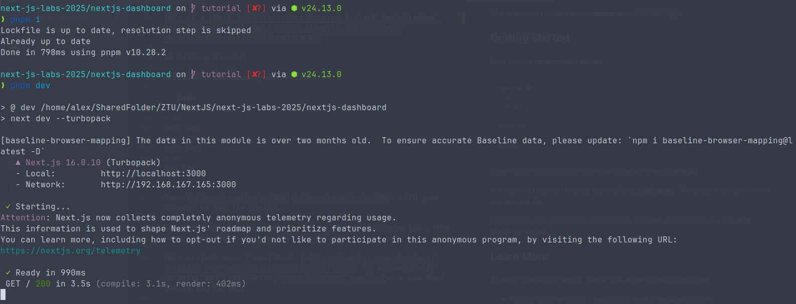
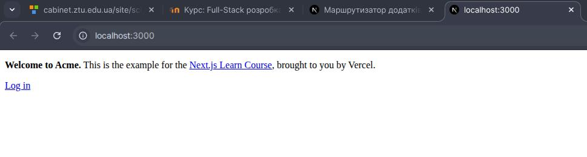
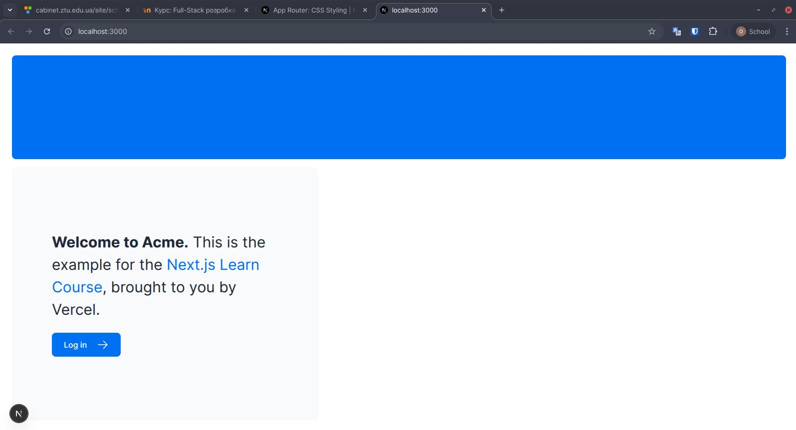
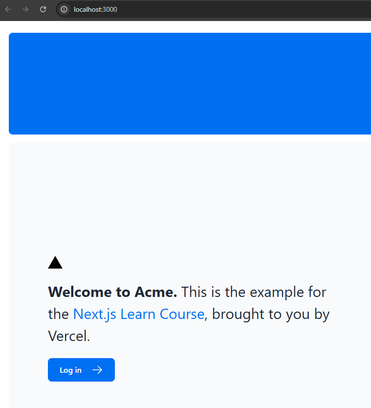
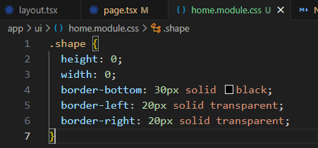
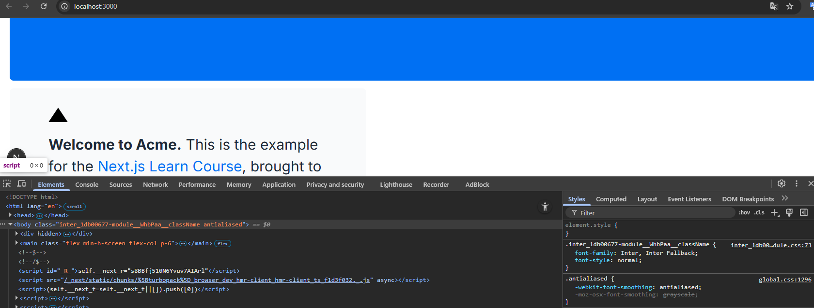
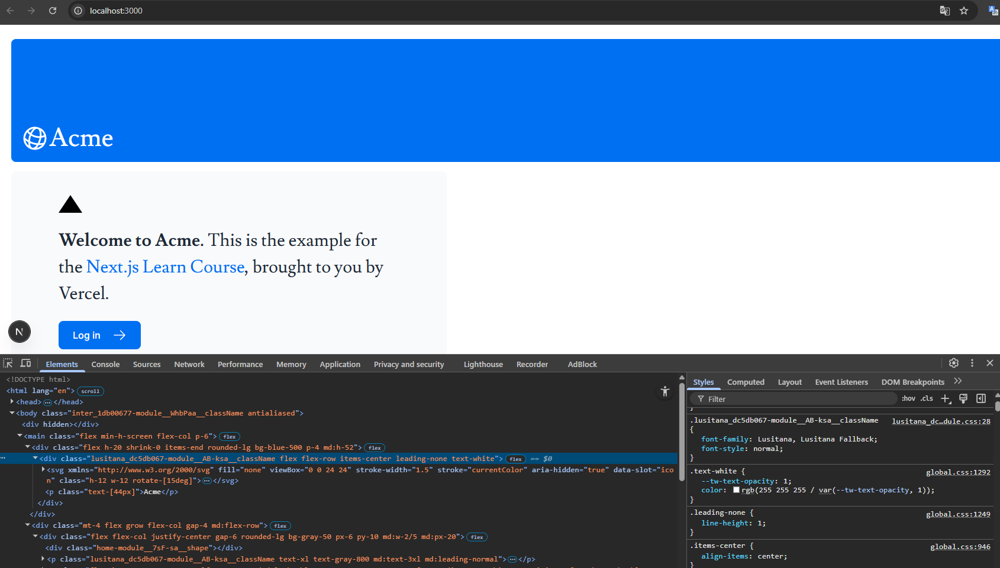
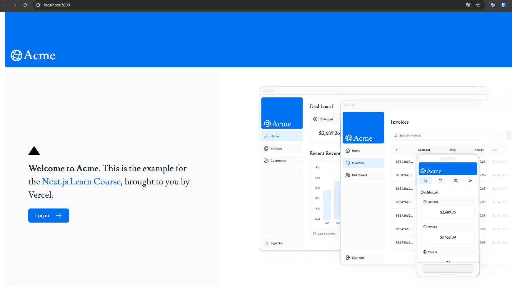
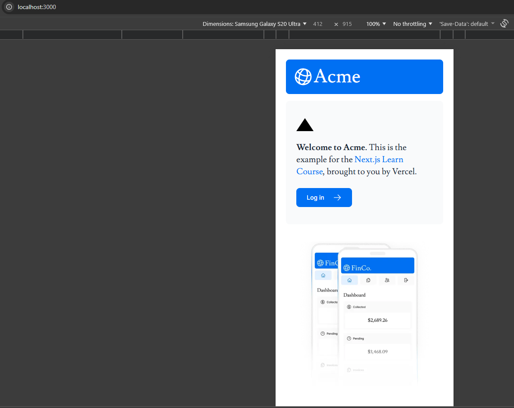

## 1. Getting Started

Console:

Browser:

## 2. CSS-стилізація

Added code to [layout.tsx](app/layout.tsx)

Added black triangle to [main page](app/page.tsx) with tailwind

Added styles to [home.module.css](app/ui/home.module.css)

## 3. Optimizing Fonts and Images

Created [fonts.ts](app/ui/fonts.ts), added Inter font to [layout.tsx](app/layout.tsx)

Added Lusitana font to [fonts.ts](app/ui/fonts.ts) and implemented it in [main page](app/page.tsx)

Added hero image to [main page](app/page.tsx)

Added mobile hero image to [main page](app/page.tsx)

